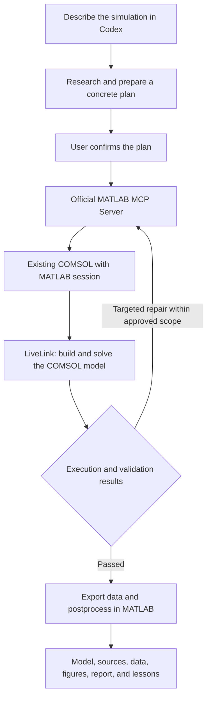

# AutoCOMSOL

**A Codex skill for planning, running, and validating COMSOL simulations through the official MATLAB MCP Server.**

English · [简体中文](README.zh-CN.md)

Describe a simulation in Codex, review the proposed plan, and let Codex write MATLAB programs that drive an existing **COMSOL with MATLAB** session. The workflow includes targeted debugging, numerical checks, result extraction, independent MATLAB postprocessing, and reproducible deliverables.

AutoCOMSOL is an independent integration project. It uses the official MathWorks MATLAB MCP Server and COMSOL LiveLink for MATLAB; it is not an official product of OpenAI, MathWorks, or COMSOL.

## How it works



The skill specifies the workflow. MCP provides the execution connection. LiveLink provides the COMSOL interface. Copying a skill folder alone does not register MCP or share a MATLAB session; the bundled bootstrap guides those first-use steps.

## Features

- Install a pinned official MATLAB MCP release with SHA-256 verification.
- Connect to an existing shared MATLAB session using `existing` mode.
- Back up Codex configuration and preserve unrelated MCP entries.
- Prepare a simulation plan for confirmation before running a new problem.
- Generate MATLAB source files, capture failures, and verify targeted fixes.
- Check task-specific numerical and physical criteria instead of treating solver completion as validation.
- Deliver a solved `.mph`, MATLAB sources, exported results, figures, reports, and artifact hashes.
- Retain concise, verified troubleshooting lessons for future tasks.

## Requirements

| Component | Requirement |
|---|---|
| Operating system | Windows x64 for the bundled installer |
| Agent | Codex with local skills, shell access, and MCP support |
| Simulation software | MATLAB, COMSOL Multiphysics, and LiveLink for MATLAB |
| Licenses | Valid licenses for MATLAB, LiveLink, and the COMSOL physics used |
| Network | Access to official GitHub release downloads during bootstrap |
| Optional diagnostic client | Python 3; no third-party Python packages required |

The installer pins **MATLAB MCP Server v0.14.0**. Its existing-session mode requires MATLAB R2023a or later. Separately, your COMSOL release must support your MATLAB release. For example, COMSOL 6.3 officially lists MATLAB R2024a/R2024b; this project's R2025b benchmark result does not extend that support matrix. See the [COMSOL compatibility requirements](https://www.comsol.com/system-requirements/63/module) and [official MCP setup documentation](https://github.com/matlab/matlab-mcp-server/tree/v0.14.0).

## Quick start

### 1. Install the skill

Clone this repository or download and extract its ZIP. In PowerShell, change to the repository root and run:

```powershell
& .\scripts\install-skill.ps1
```

This copies the skill to `$CODEX_HOME/skills/autocomsol`, or the current user's `.codex/skills/autocomsol` when `CODEX_HOME` is unset. It refuses to overwrite a different existing skill. Alternatively, copy the complete repository folder into the skill directory and name it `autocomsol`.

### 2. Install and register the official MCP server

```powershell
& .\scripts\install-mcp.ps1 -RegisterMcp
```

The installer downloads official assets, checks their hashes, generates `prepare_session.m`, and registers `autocomsol_matlab` in Codex. It backs up an existing config and refuses a conflicting MATLAB registration. Network and user-directory access may require approval in your Codex environment.

You can also ask Codex to perform these steps after installing the skill:

```text
Use $autocomsol to complete first-time setup, check the connection,
and run the included acceptance benchmark.
```

### 3. Share the correct MATLAB session

Open **COMSOL with MATLAB**. In that MATLAB command window, run the exact `prepare_session.m` path printed by the installer:

```matlab
run('FULL_PATH_PRINTED_BY_THE_INSTALLER/prepare_session.m')
```

The script checks LiveLink, installs the downloaded official MATLAB MCP Toolbox when needed, and shares that session. Once the Toolbox is installed, share the session again after each MATLAB restart with:

```matlab
shareMATLABSession()
```

With multiple MATLAB windows, the official server connects to the most recently shared session. This is the MCP Toolbox sharing command, not `matlab.engine.shareEngine` from the Python Engine API.

### 4. Reload MCP and validate

Reload MCP in Codex, or restart Codex and open a new chat while leaving MATLAB open. Ask:

```text
Use $autocomsol. Verify that autocomsol_matlab is available, inspect the
shared MATLAB/COMSOL versions, and run the included acceptance benchmark.
Report passed checks and any unresolved compatibility issues.
```

For detailed setup and troubleshooting, see [Connection setup](references/setup.md).

## Use it for a simulation

Provide geometry, materials, loads or boundary conditions, study type, target quantities, and any accuracy or compute constraints. For example:

```text
Use $autocomsol to plan a stationary heat-transfer simulation of my device.
I will provide the geometry and material properties. First identify missing
inputs and propose the mesh, solver, result exports, and validation criteria.
Wait for my confirmation before running the model.
```

The first response to a new simulation must show a concrete plan in the chat, save a revisioned `plan.md` as `AWAITING_CONFIRMATION`, and stop. Only after your confirmation does Codex write and run the simulation programs. A file-only plan or an internal checklist is insufficient. Connection checks and research may run beforehand; sharing MATLAB or approving tool access does not approve a simulation. The bundled acceptance simulation follows the same rule.

After confirmation, routine code repairs within the approved plan can continue. Changes to physical assumptions, boundary conditions, agreed accuracy, or compute scope require a revised plan and confirmation. Approval already given for the same concrete plan remains valid; an explicit instruction to skip confirmation overrides the default workflow. Uncertain API details should be checked against documentation for the installed COMSOL version.

If an older chat skipped this step, start a new chat with the updated skill and explicitly invoke `$autocomsol`. These are agent workflow instructions, not an execution lock inside the official MATLAB MCP Server.

The [simulation workflow](references/simulation.md) defines validation, retry boundaries, provenance, and delivery requirements.

## Deliverables

Typical task output:

```text
simulation-run/
├── plan.md
├── config.json
├── src/                 # Build, solve, extract, postprocess, validate
├── models/final.mph
├── results/             # MAT/CSV and units/solution metadata
├── figures/
├── report.md
├── environment.json
├── manifest.json        # Artifact hashes
└── logs/
    ├── run.log
    └── lessons.jsonl    # Verified fixes only
```

Exact files depend on the task. The included benchmark records its fixed inputs in `plan.md`. Independent postprocessing reads exported data and does not require a live COMSOL model.

## Included acceptance benchmark

The [steady-conduction example](assets/smoke/plan.md) uses a 0.1 m × 0.02 m rectangle, constant conductivity, fixed left/right temperatures, and insulated upper/lower edges. It compares COMSOL with an analytic solution, runs two mesh settings, saves and reloads the model, exports data, and generates MATLAB figures.


Validated on Windows with MATLAB MCP v0.14.0, MATLAB R2025b, and COMSOL 6.3 build 290:

| Check | Observed result |
|---|---:|
| Maximum temperature error | 6.59 × 10⁻¹¹ K |
| Relative boundary-flux error | 3.48 × 10⁻¹² |
| Relative energy imbalance | 5.33 × 10⁻¹² |
| Temperature difference between meshes | 4.58 × 10⁻¹¹ K |
| Temperature difference after model reload | 0 K |

Relocated delivery sources also reproduced the result in the same MATLAB service session. These are infrastructure benchmark results, not evidence that an arbitrary model is physically correct. A linear solution is especially easy to represent accurately; this does not replace a convergence study for a real problem. See [actual validation scope](references/release-validation.md).

## Moving to another computer

Carry this repository or its ZIP, install the skill, and run first-time bootstrap on the new computer. The scripts resolve the new user's Codex directory and do not depend on the development machine's paths. No MATLAB, COMSOL, or MCP binary is redistributed here.

The new computer still needs licensed simulation software, official dependency downloads, session sharing, and its own acceptance test. Copying the skill does not automatically execute installation.

## Current limitations

- Automatic setup supports Windows x64 only.
- The tested COMSOL 6.3 / MATLAB R2025b pair is outside COMSOL 6.3's officially listed MATLAB versions.
- No reliable background job supervisor, guaranteed cancellation, or unattended restart recovery is implemented.
- A tool timeout means the simulation state is unknown; check logs before retrying.
- Some localized console text was corrupted through the tested MCP response channel. Explicit UTF-8 JSON and error files remained readable.
- Do not let multiple clients modify the same MATLAB/COMSOL session concurrently.
- Verification on a second physical computer and native tool activation in a fresh Codex chat were not part of the original benchmark.

## Repository map

| Path | Purpose |
|---|---|
| [SKILL.md](SKILL.md) | Agent workflow and execution rules |
| [scripts/](scripts/) | Skill/MCP installation, diagnostic transport, MATLAB helpers |
| [assets/mcp-release.json](assets/mcp-release.json) | Pinned official version and asset hashes |
| [assets/smoke/](assets/smoke/) | Reproducible synthetic acceptance example |
| [references/](references/) | Setup, simulation, validation, and verified lessons |
| [INSTALL.zh-CN.md](INSTALL.zh-CN.md) | Short Chinese installation guide |

MATLAB, COMSOL, LiveLink, and the official MATLAB MCP Server remain subject to their respective licenses. This repository does not grant licenses to those products.
