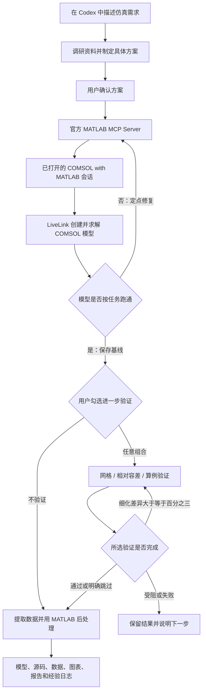
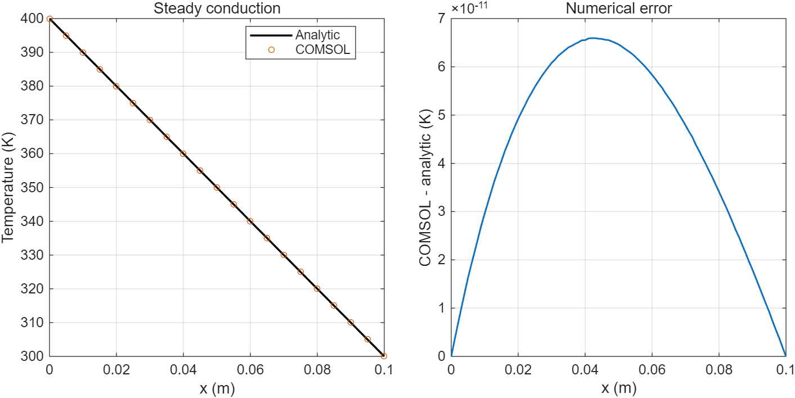

# AutoCOMSOL

**通过官方 MATLAB MCP Server，让 Codex 规划、执行和验证 COMSOL 仿真的 Skill。**

[English](README.md) · 简体中文

在 Codex 中描述仿真任务，确认方案后，由 Codex 编写 MATLAB 程序，驱动已经打开的 **COMSOL with MATLAB** 会话。流程涵盖错误诊断与修复、数值验证、结果提取、独立 MATLAB 后处理及可复现交付。

AutoCOMSOL 是独立集成项目，使用 MathWorks 官方 MATLAB MCP Server 和 COMSOL LiveLink for MATLAB，不是 OpenAI、MathWorks 或 COMSOL 的官方产品。

## 工作流程



Skill 规定工作流程，MCP 提供执行连接，LiveLink 提供 COMSOL 接口。仅复制 Skill 文件夹不会自动注册 MCP 或共享 MATLAB 会话；首次配置由包内安装脚本引导完成。

## 功能

- 安装固定版本的官方 MATLAB MCP，并校验 SHA-256。
- 以 `existing` 模式连接已经共享的 MATLAB 会话。
- 注册前备份 Codex 配置，保留其他 MCP 项。
- 针对新仿真先提出具体方案，等待用户确认。
- 生成 MATLAB 源码、记录错误、定点修复并复测。
- 初次调通优先采用研究自动生成的默认求解器，并将适用的主迭代上限设为 200，读取确认实际设置。
- 先按任务跑通模型，再提供网格、相对容差、算例验证三个独立选项，也可不进行进一步验证。
- 交付带解的 `.mph`、源码、结果、图表、反映最终方案的 Word 规划、Word 报告及文件校验清单。
- 保存简短且经过验证的错误解决记录，供后续任务检索。

## 环境要求

| 项目 | 要求 |
|---|---|
| 操作系统 | 包内自动安装器支持 Windows x64 |
| 智能体环境 | 支持本地 Skill、Shell 和 MCP 的 Codex |
| 仿真软件 | MATLAB、COMSOL Multiphysics、LiveLink for MATLAB |
| 许可 | MATLAB、LiveLink 及任务涉及物理场的有效许可 |
| 网络 | 首次安装时可访问 GitHub 官方发布文件 |
| 可选诊断客户端 | Python 3，无须额外 Python 库 |

安装器固定使用 **MATLAB MCP Server v0.14.0**，其现有会话模式要求 MATLAB R2023a 或更高版本。还必须单独核对 COMSOL 与 MATLAB 的兼容关系。例如 COMSOL 6.3 官方列出的是 MATLAB R2024a/R2024b；本项目在 R2025b 上的测试通过，不代表该组合获得官方支持。参见 [COMSOL 兼容要求](https://www.comsol.com/system-requirements/63/module)和[官方 MCP 安装说明](https://github.com/matlab/matlab-mcp-server/tree/v0.14.0)。

## 快速开始

### 1. 安装 Skill

克隆本仓库，或下载 ZIP 后解压。在 PowerShell 中进入仓库根目录，执行：

```powershell
& .\scripts\install-skill.ps1
```

脚本将 Skill 安装到 `$CODEX_HOME/skills/autocomsol`；未设置 `CODEX_HOME` 时，使用当前用户的 `.codex/skills/autocomsol`。发现内容不同的已有 Skill 时会停止，不直接覆盖。也可以手动将完整仓库文件夹复制到技能目录，并命名为 `autocomsol`。

### 2. 安装并注册官方 MCP

```powershell
& .\scripts\install-mcp.ps1 -RegisterMcp
```

安装器下载并校验官方文件，生成 `prepare_session.m`，将 `autocomsol_matlab` 注册到 Codex。已有配置会先备份；遇到冲突的 MATLAB 注册项会停止。网络访问及用户目录写入可能需要 Codex 环境授权。

安装 Skill 后，也可以直接对 Codex 说：

```text
使用 $autocomsol 完成首次安装、连接检查和自带的最小验收测试。
```

### 3. 共享正确的 MATLAB 会话

打开 **COMSOL with MATLAB**，在该 MATLAB 命令窗口运行安装器打印的完整路径：

```matlab
run('安装器输出的完整路径/prepare_session.m')
```

脚本检查 LiveLink，按需安装已下载的官方 MATLAB MCP Toolbox，并共享当前会话。Toolbox 安装完成后，每次重新启动 MATLAB，只需在目标窗口执行：

```matlab
shareMATLABSession()
```

有多个 MATLAB 窗口时，官方服务器连接最近共享的会话。这里使用的是 MCP Toolbox 的共享命令，不是 Python Engine 的 `matlab.engine.shareEngine`。

### 4. 刷新 MCP 并验收

在 Codex 中重载 MCP，或保持 MATLAB 打开、重启 Codex 后开启新聊天。输入：

```text
使用 $autocomsol。确认 autocomsol_matlab 工具可用，读取共享的
MATLAB/COMSOL 实际版本，并运行自带验收案例，报告通过项与未解决问题。
```

连接与排错细节见[安装和连接说明](references/setup.md)。

## 如何开展实际仿真

提供几何、材料、载荷或边界条件、研究类型、目标结果，以及精度和计算资源约束。例如：

```text
使用 $autocomsol 规划器件的稳态传热仿真。我会提供几何和材料参数。
请先识别缺失信息，并提出网格、求解器、结果导出和验证方案，
等待我确认后再执行。
```

新仿真的首次方案回复必须在聊天中展示具体规划，保存带版本号的 `plan.md` 工作源稿与 `documents/plan-proposed-vN.docx`，标记为等待确认，然后停止等待。收到你的确认后才编写和运行仿真程序。仅保存文件、输出内部待办清单不算展示方案。确认前可以检查连接、调研资料；共享 MATLAB 会话、授予工具权限不等于确认仿真方案。自带验收仿真也遵循这一规则。

确认后，方案范围内的常规代码修复可继续自动执行。若需要改变物理假设、边界条件、约定精度或计算范围，应展示修订方案并重新确认。同一具体方案已经获得的确认持续有效；如果你明确要求跳过确认，以你的指令为准。对不确定的 API，应查询与安装版本一致的文档。

如果旧聊天曾跳过此步骤，更新 Skill 后请新建聊天并显式调用 `$autocomsol`。这些是智能体工作流规则，官方 MATLAB MCP Server 内部并没有因此新增执行锁。

[仿真工作流说明](references/simulation.md)定义了验证要求、重试边界、来源记录和交付规范。

## 跑通模型后，自选验证

模型按任务初步跑通并保存后，Codex 停下来让你选择：

- [ ] 网格验证
- [ ] 容差（相对容差）验证
- [ ] 算例验证

可选择任意组合，也可明确回复 **“不进行进一步验证”**，直接使用已跑通模型继续任务。最初的方案确认不代表选中了这些验证。对于没有原生多选控件的界面，包内提供[勾选表单](assets/validation-choice.html)：勾选后生成选择文字，发送回原聊天才开始执行；未提交的勾选不算确认。

网格验证先规划粗、中、精三档；相对容差验证在固定网格上规划宽松、中等、严格三档。两种验证均以前两档分别对比第三档，要求所有约定关键结果的差异 **严格小于 3%**，否则重新规划三档并迭代，直至满足要求。遇到真实的执行、资源或约定预算限制会保留模型并报告未完成，不会当作通过。比较指标与近零量的合理归一化尺度在测试前确定，不为通过而修改。这些差异衡量结果敏感性，不等于真实误差上界。

算例验证优先使用已上传文献中的相关算例。没有资料时，Codex 会请你上传，或回复 **“请直接网上查找相关算例”** 后再联网调研。找到可复现的相关算例就验证；找不到则输出 **“未调研到相关算例”**，跳过算例验证并继续任务。文献对照采用文献或任务适用的判据，不自动套用 3% 阈值。详见[完整验证流程](references/validation.md)。

报告分别记录通过、失败、受阻和跳过。选择不验证后，不会换个名目自动追加收敛或复现求解。

## 交付内容

任务完成后，根据**实际采用的模型与执行方案**重写规划，将排错、所选验证中最终采用的修改纳入正文；最初方案及确认记录另行保留。最终规划依次介绍 **仿真任务 → 科学分析、建模依据与必要理论 → COMSOL 具体设置**。报告与最终规划采用相同的模型和设置，说明实际结果及验证状态。

规划与报告均交付 **Word `.docx` 文件，语言跟随仿真任务的提问语言**：中文提问输出中文，英文提问输出英文；明确指定其他语言时按指定执行。公式、正文中的数学变量及表格中的数学符号均使用 **Word 内置可编辑公式 OMML**，不以公式图片或未转换的 LaTeX 代替。交付前检查内容一致性、公式结构和逐页排版。详见 [Word 交付规范](references/word-delivery.md)。

`models/` 仅保留首次成功跑通的模型、实际验证模型、覆盖各项最终任务的模型，以及 `readme.md`。`results/` 仅保留验证结果、最终任务结果及必要的结果元数据，以及 `readme.md`。两个说明文件逐项列出文件用途，并关联模型、任务和结果。`source/` 默认存放原始输入与参考资料，生成文件说明；`src/readme.md` 说明每个程序文件、结构组成、功能、依赖、具体运行命令和执行顺序。调试模型与检查点放在 `work/`，运行状态和日志放在 `logs/`。详见[目录交付规范](references/delivery-layout.md)。

初次调通优先使用自动生成的默认求解器，将适用的主迭代上限设为 **200**。先检查实际求解器类型和生效的终止条件，再设置相应属性并读回确认，不把所有嵌套求解器一律改为 200。200 是初始偏好，不是强制迭代次数或收敛保证。详见[初始求解器规则及官方 API 依据](references/initial-solver.md)。

典型任务目录：

```text
simulation-run/
├── plan.md              # 当前方案的工作源稿
├── plans/revisions/     # 早期方案及真实确认记录
├── documents/
│   ├── simulation-plan.docx    # 最终采用的仿真方案
│   └── simulation-report.docx # 结果与分析报告
├── config.json
├── source/
│   └── readme.md        # 原始输入和参考资料的用途
├── src/
│   └── readme.md        # 程序文件、结构、运行命令和顺序
├── models/
│   ├── readme.md
│   ├── baseline-first-success.mph
│   ├── validation/     # 实际执行的所选验证模型
│   └── final/          # 与各项最终任务对应的模型
├── results/
│   ├── readme.md
│   ├── validation/     # 所选验证结果
│   └── final/          # 最终任务结果
├── figures/
├── environment.json
├── manifest.json        # 文件哈希清单
├── work/               # 调试和探索文件，不混入正式结果
└── logs/
    ├── run.log
    ├── validation-status.json
    └── lessons.jsonl    # 仅记录已验证的修复
```

具体文件随任务调整，但最终两份 Word 文档为必需交付，Markdown 仅作为补充源稿。历史基准将固定输入记录在 `plan.md` 中，并生成 Markdown 报告；使用其原始输出时，仍需根据实际结果补齐最终方案与 Word 报告，才能满足当前交付要求。独立后处理脚本读取导出的数据，无须保留 COMSOL 中的实时模型对象。

## 自带验收案例

[稳态导热案例](assets/smoke/plan.md)采用 0.1 m × 0.02 m 矩形、常数导热系数、左右端恒温、上下绝热。程序对照解析解，计算两级网格，保存并重载模型，导出数据并绘制 MATLAB 图表。

其中 `run_smoke` / `run_all` 是一次执行完整流程的历史回归入口，并未实现新的三档可选验证流程。普通任务或初次配置使用拆分的建模、求解、提取函数先跑一个基线模型，然后询问验证选项；只有明确要求复跑完整历史回归时，才调用原入口。



本机验收环境为 Windows、MATLAB MCP v0.14.0、MATLAB R2025b、COMSOL 6.3 build 290：

| 检查项 | 实测结果 |
|---|---:|
| 温度最大绝对误差 | 6.59 × 10⁻¹¹ K |
| 边界热流相对误差 | 3.48 × 10⁻¹² |
| 相对能量不平衡 | 5.33 × 10⁻¹² |
| 两级网格温度差 | 4.58 × 10⁻¹¹ K |
| 保存重载温度差 | 0 K |

交付源码复制到另一目录后，也在同一 MATLAB 服务会话中复跑通过。这些结果用于验证自动化链路；线性解析解容易被有限元准确表示，不能据此认定任意模型物理正确，也不能替代真实问题的收敛研究。完整边界见[实际验收范围](references/release-validation.md)。

## 迁移到新电脑

携带本仓库或 ZIP，在新电脑安装 Skill 并完成首次引导。脚本根据新用户环境定位 Codex 目录，不依赖开发电脑的盘符或用户名。仓库不分发 MATLAB、COMSOL 或 MCP 二进制文件。

新电脑仍需具备软件和许可、下载官方依赖、共享目标会话，并重新运行验收。复制 Skill 本身不会自动执行安装。

## 当前限制

- 自动安装目前只支持 Windows x64。
- 已测试的 COMSOL 6.3 / MATLAB R2025b 不在 COMSOL 6.3 官方列出的 MATLAB 版本组合中。
- 尚未实现可靠的长任务后台调度、保证可用的取消机制或无人值守的跨重启恢复。
- 工具超时表示执行状态未知，重试前必须检查日志与实际状态。
- 已测试 MCP 通道对部分中文控制台文本出现乱码；显式写出的 UTF-8 JSON 和错误日志可正常读取。
- 不应让多个执行方同时修改同一 MATLAB/COMSOL 会话。
- 原始验收没有覆盖第二台物理电脑，也没有在新 Codex 聊天中验证原生工具激活。

## 仓库结构

| 路径 | 内容 |
|---|---|
| [SKILL.md](SKILL.md) | 智能体工作流与执行规则 |
| [scripts/](scripts/) | Skill/MCP 安装器、诊断客户端、MATLAB 辅助程序 |
| [assets/mcp-release.json](assets/mcp-release.json) | 固定版本及官方文件哈希 |
| [assets/smoke/](assets/smoke/) | 可复现的合成验收案例 |
| [references/](references/) | 安装、仿真、验收说明与已验证经验 |
| [INSTALL.zh-CN.md](INSTALL.zh-CN.md) | 简版中文安装指南 |

MATLAB、COMSOL、LiveLink 及官方 MATLAB MCP Server 分别遵循各自许可；本仓库不授予这些产品的使用许可。
